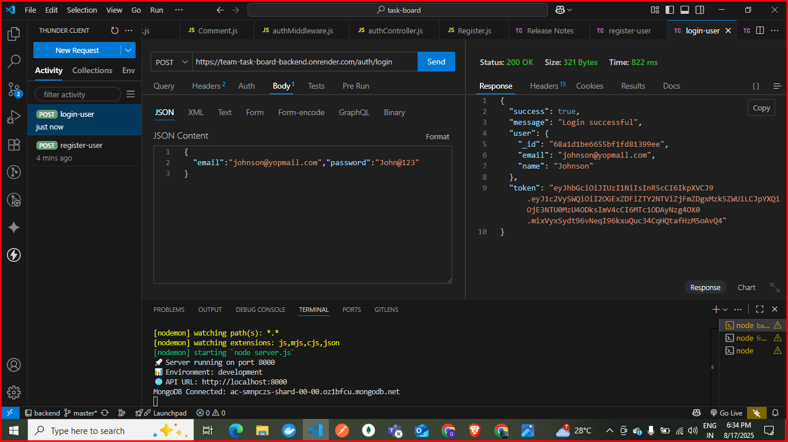
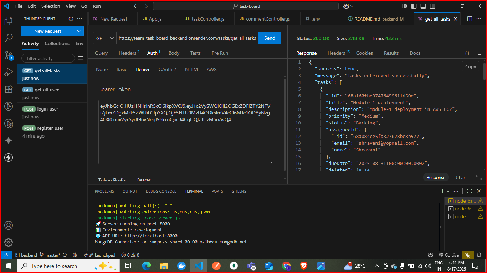
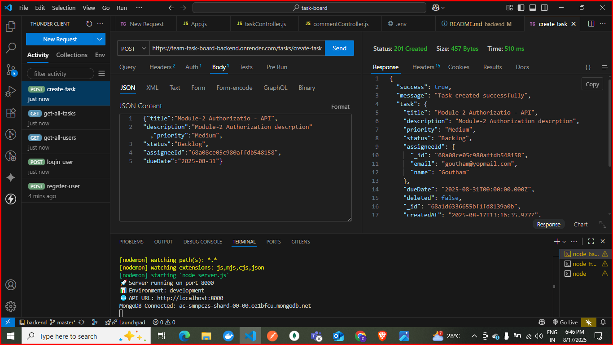
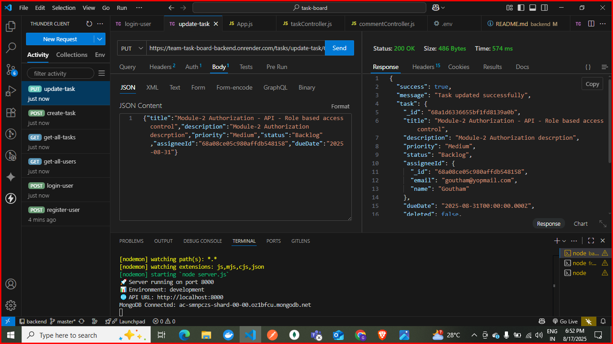
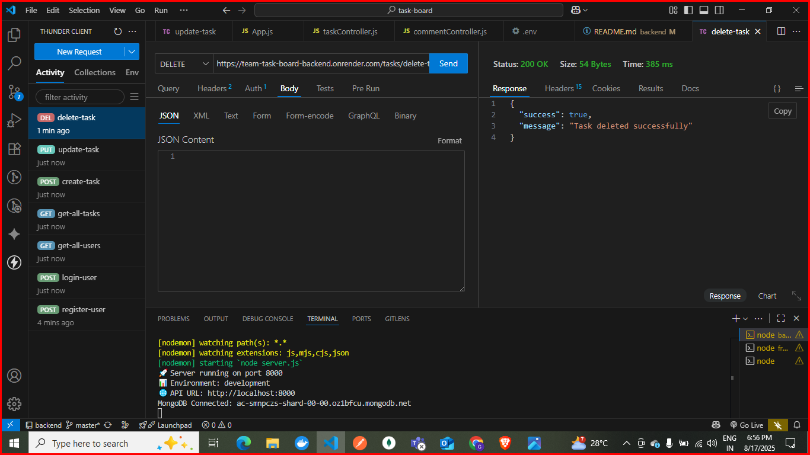
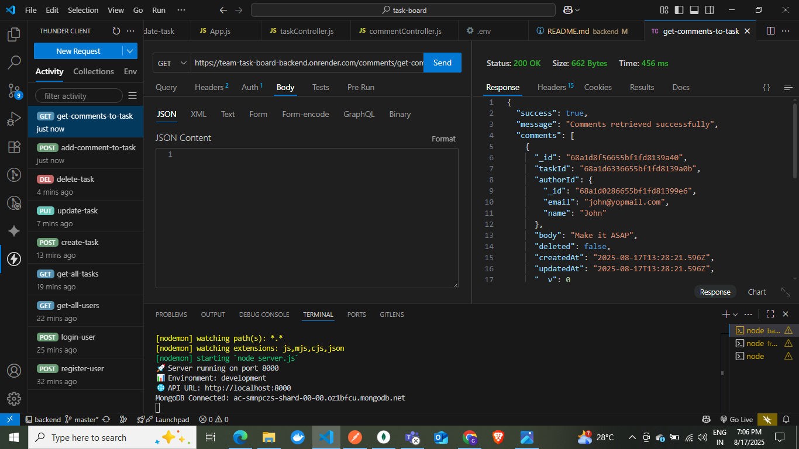
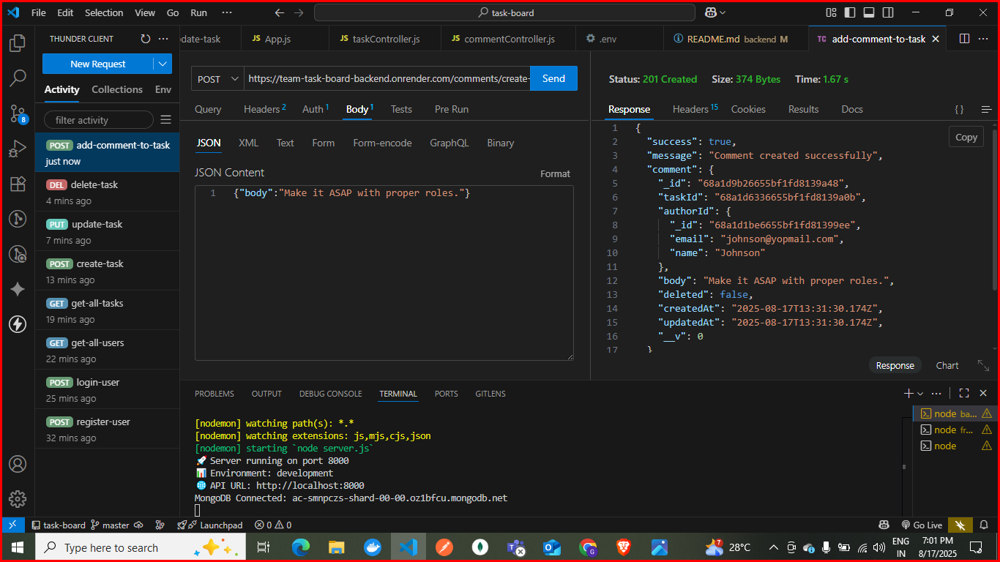
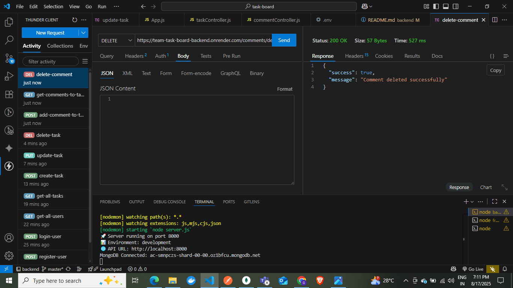

# Task Board Backend API

A RESTful API for a task management application built with Node.js, Express, and MongoDB.

## Features

- User authentication (register/login)
- JWT-based authorization
- Task management (CRUD operations)
- Comment system
- User management
- Secure password hashing

## Tech Stack

- **Node.js** - Runtime environment
- **Express.js** - Web framework
- **MongoDB** - Database
- **Mongoose** - ODM for MongoDB
- **JWT** - Authentication tokens
- **bcryptjs** - Password hashing
- **CORS** - Cross-origin resource sharing

## Prerequisites

- Node.js (v14 or higher)
- MongoDB (local installation or MongoDB Atlas)
- npm or yarn package manager

## Installation

1. Clone the repository and navigate to the backend directory:
```bash
cd task-board/backend
```

2. Install dependencies:
```bash
npm install
```

3. Create a `.env` file in the root directory with the following variables:
```env
PORT=8000
MONGODB_URI=mongodb://localhost:27017/taskboard
JWT_SECRET=your_jwt_secret_key_here
NODE_ENV=development
```

4. Start the development server:
```bash
npm run dev
```

The server will start on http://localhost:8000

## Scripts

- `npm start` - Start the production server
- `npm run dev` - Start the development server with nodemon

## API Endpoints

### Authentication Routes
- `POST /auth/register` - Register a new user
.png>)
- `POST /auth/login` - Login user

- `GET /auth/users` - Get all users (protected)


### Task Routes (Protected)
- `GET /tasks/get-all-tasks` - Get all tasks

- `POST /tasks/create-task` - Create a new task

- `PUT /tasks/update-task/:id` - Update a task

- `DELETE /tasks/delete-task/:id` - Delete a task

- `PATCH /tasks/:id/move` - Update a task status
.png>)

### Comment Routes (Protected)
- `GET /comments/get-comment-for-task/:taskId` - Get comments for a task

- `POST /comments/create-comment/:taskId` - Add a comment to a task

- `DELETE /comments/delete-comment/:id` - Delete a comment


## Authentication

The API uses JWT tokens for authentication. Include the token in the Authorization header:
```
Authorization: Bearer <your_jwt_token>
```

## Environment Variables

| Variable | Description | Default |
|----------|-------------|---------|
| PORT | Server port | 8000 |
| MONGODB_URI | MongoDB connection string | mongodb://localhost:27017/taskboard |
| JWT_SECRET | Secret key for JWT tokens | Required |
| NODE_ENV | Environment (development/production) | development |

## Deployment

### Production Setup

1. Set environment variables:
```env
NODE_ENV=production
PORT=8000
MONGODB_URI=your_production_mongodb_uri
JWT_SECRET=your_secure_jwt_secret
```

2. Build and start:
```bash
npm install --production
npm start
```

### Docker Deployment (Optional)

Create a `Dockerfile`:
```dockerfile
FROM node:16-alpine
WORKDIR /app
COPY package*.json ./
RUN npm install --production
COPY . .
EXPOSE 5000
CMD ["npm", "start"]
```

## Project Structure

```
backend/
├── config/
│   ├── auth.js          # JWT configuration
│   └── database.js      # Database connection
├── controllers/
│   ├── authController.js    # Authentication logic
│   ├── taskController.js    # Task management logic
│   └── commentController.js # Comment management logic
├── middleware/
│   └── authMiddleware.js    # JWT authentication middleware
├── models/
│   ├── User.js          # User schema
│   ├── Task.js          # Task schema
│   └── Comment.js       # Comment schema
├── routes/
│   ├── auth.js          # Authentication routes
│   ├── tasks.js         # Task routes
│   └── comments.js      # Comment routes
├── utils/
│   └── helpers.js       # Utility functions
├── app.js               # Express app configuration
├── server.js            # Server entry point
└── package.json         # Dependencies and scripts
```

## Error Handling

The API returns consistent error responses in the following format:
```json
{
  "success": false,
  "message": "Error description"
}
```

## Security Features

- Password hashing with bcryptjs
- JWT token authentication
- Input validation
- CORS configuration
- Environment variable protection

## Contributing

1. Fork the repository
2. Create a feature branch
3. Make your changes
4. Add tests if applicable
5. Submit a pull request

## License

This project is licensed under the MIT License.